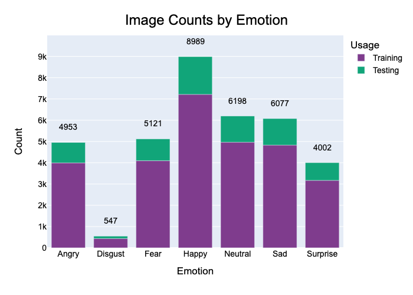
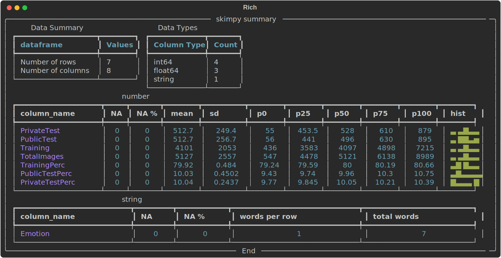
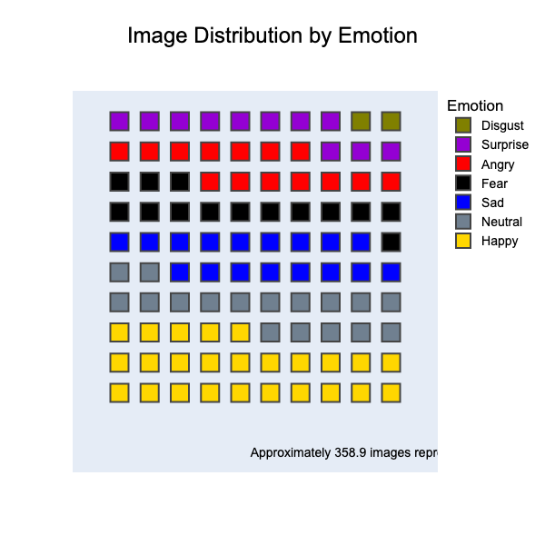

# Emotion Face Classifier

Computer vision project to classify facial expressions into one of 7 emotion categories.

The categories are: 'Angry', 'Disgust', 'Fear', 'Happy', 'Sad', 'Surprise', & 'Neutral'.

This repo is a revisitation of my [emotion_face_classification](https://github.com/dlumian/emotion_face_classification) repo from 2018.

## Sections
- [Data Sources](#data-sources)
- [FER 2013](#fer-2013)

## Data Sources

[Return to Top](#sections)

Data comes from two Kaggle datasets. Overlapping similarities of the two datasets are listed here. Unique features are included below each data link. Data can be downloaded from the links and then saved into the structure specified below. 

- Overlap in data sources
    - Emotions: 'Angry', 'Disgust', 'Fear', 'Happy', 'Sad', 'Surprise', & 'Neutral'
    - 48x48, greyscale images 
- [Kaggle FER2013](https://www.kaggle.com/competitions/challenges-in-representation-learning-facial-expression-recognition-challenge/data).
    - Stored as pixel values in a csv file
    - When uncompressed, move `fer2013.csv` into path: `EmotionFaceClassifier/data/fer2013/fer2013.csv`
- [Kaggle Facial Recognition Dataset](https://www.kaggle.com/datasets/apollo2506/facial-recognition-dataset/data)
    - Stored as jpg files
    - Data is organized into training and testing with a directory for each emotion in those directories. The `Emotion` at the end of the path must be replaced with the proper emotion label.
        - Train path: `EmotionFaceClassifier/data/frd2020/Training/Emotion`
        - Test path: `EmotionFaceClassifier/data/frd2020/Testing/Emotion`

## FER 2013

[Return to Top](#sections)

### [EDA](./notebooks/FER2013_EDA.ipynb)

#### Visualizations

##### Raw Image Data

##### Count Summary Data

##### Example Images by Emotion Category

