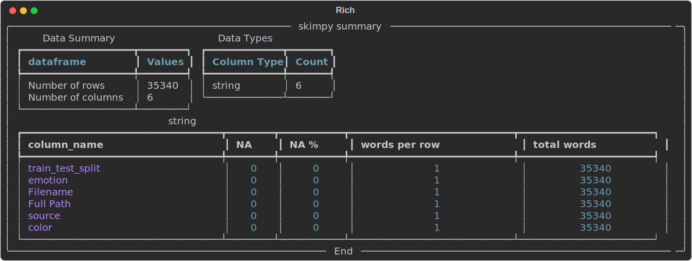
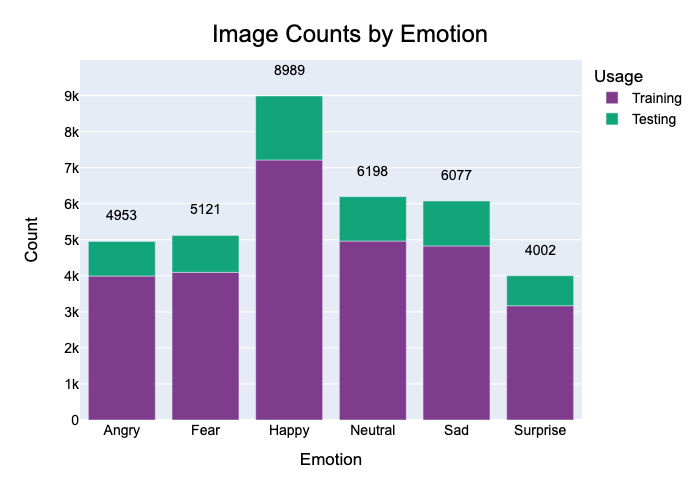
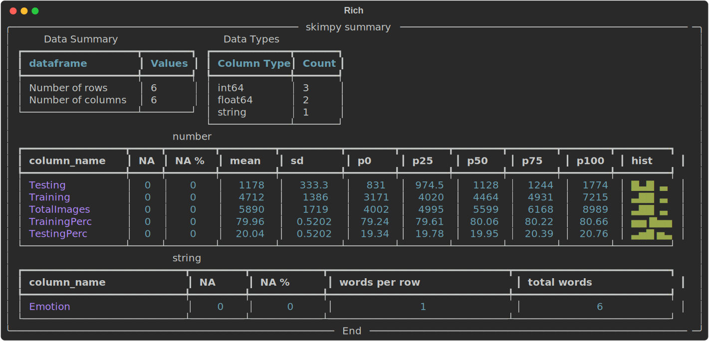
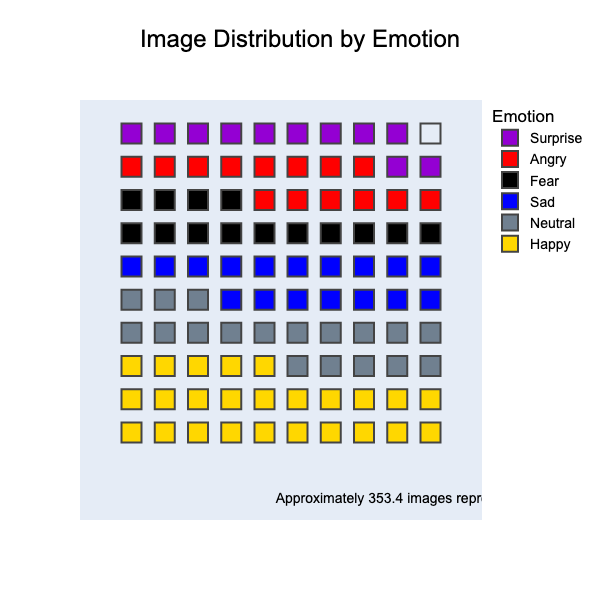
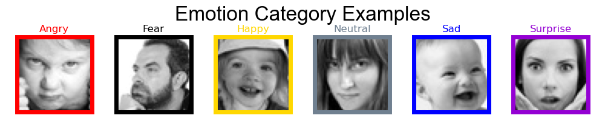
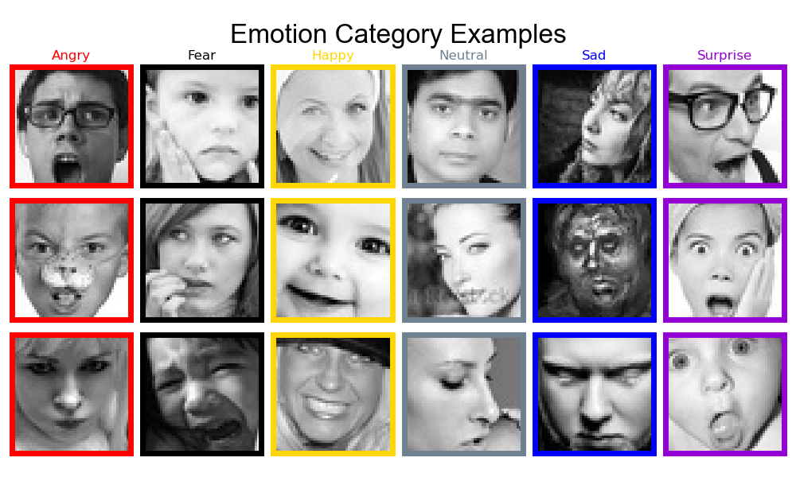

# Emotion Face Classifier

Computer vision project to classify facial expressions into one of 6 or 7 emotion categories.

The categories are: 'Angry', 'Disgust', 'Fear', 'Happy', 'Sad', 'Surprise', & 'Neutral'.

**Disgust** is only a category in one dataset and is underrepresented there. It will be included in some models and not other as modeling resuls dictate.

This repo is a revisitation of my [emotion_face_classification](https://github.com/dlumian/emotion_face_classification) repo from 2018.

## Sections
- [Data Sources](#data-sources)
    - [FER 2013](#kaggle-fer2013)
    - [FRD 2020](#kaggle-facial-recognition-dataset)
- [Data Alignment](#data-alignment)
- [EDA and Summary Statistics](#eda-and-summary-statistics)
- [Directory Setting](#directory-setting)

## Data Sources

[Return to Top](#sections)

Data comes from two Kaggle datasets. Overlapping similarities of the two datasets are listed here. Unique features are included below each data link. Data can be downloaded from the links and then saved into the structure specified below. 

### Overlap in data sources
    - Emotions: 'Angry', 'Fear', 'Happy', 'Sad', 'Surprise', & 'Neutral'
    - 48x48, greyscale images 

### [Kaggle FER2013](https://www.kaggle.com/competitions/challenges-in-representation-learning-facial-expression-recognition-challenge/data).
    - Stored as pixel values in a csv file
    - Includes `Disgust` as additional category
    - Has 3 usage categories: train, public test, private test
    - Since not in contest, usage combines public and private tests
    - When uncompressed, move `fer2013.csv` into path: `EmotionFaceClassifier/data/fer2013/fer2013.csv`
    - To facilitate analysis design with both datasets, [Image Generator notebook](./notebooks/FER2013_Image_Generator.ipynb) creates jpg files from csv data using same naming conventions as FRD2020 dataset

### [Kaggle Facial Recognition Dataset](https://www.kaggle.com/datasets/apollo2506/facial-recognition-dataset/data)
    - Stored as jpg files
    - Data is organized into training and testing with a directory for each emotion in those directories. The `Emotion` at the end of the path must be replaced with the proper emotion label.
        - Train path: `EmotionFaceClassifier/data/frd2020/Training/Emotion`
        - Test path: `EmotionFaceClassifier/data/frd2020/Testing/Emotion`

## Data Alignment
[Return to Top](#sections)

For consistency and structure, an [Image Generator Notebook](./notebooks/FER2013_Image_Generator.ipynb) is used to convert the pixel arrays in the FER2013 to jpgs. The directory structure used for storing them aligns with that of the data from the FRD2020 data.

Also of note, `Surprise` is misspelled in the FRD2020 dataset.

## EDA and Summary Statistics
[Return to Top](#sections)

### [FER 2013 Notebook](./notebooks/FER2013_EDA.ipynb)

#### Raw Image Data

#### Count Summary Data

#### Example Images by Emotion Category

### [FRD 2020 Notebook](./notebooks/FRD2020_EDA.ipynb)

#### Raw Image Data

#### Count Summary Data

#### Example Images by Emotion Category

## Directory Setting
[Return to Top](#sections)

As the first step in notebooks and also available from [src.helpers.py](./src/helpers.py), a `check_directory_name` function is run initially. This function takes one argument which is the top level directory of the repo, here `EmotionFaceClassifier`. It iteratively checks and moves up the current directory path to match that string to the current directory. It returns `False`, if no match is found. This helps ensure that all path and imports work correctly. While it requires redundant code, as it can not be imported if the wrong directory is set, I have found it useful in many instances, especially training and teaching.

Therefore, before running the main code or importing from `src`, it is advisable to use `check_directory_name`.